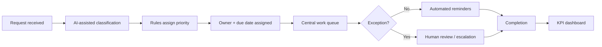

# AI-Enabled Healthcare Workflow Automation Case Study

## Executive Overview

This portfolio project redesigns a fictional ambulatory healthcare work-queue process for referrals, prior authorizations, patient messages, documentation follow-up, and administrative requests.

The case study demonstrates how structured rules, AI-assisted classification, ownership assignment, service-level targets, automated reminders, exception handling, and KPI reporting can turn a fragmented manual process into a more visible and scalable operating system.

All data, organizations, requests, staffing assumptions, and results are synthetic.

## Business Problem

The fictional practice relies on shared inboxes, spreadsheets, email, and individual memory to track work. Requests arrive through multiple channels and are manually reviewed before someone decides who owns them.

The current-state process creates several operational risks:

- inconsistent ownership;
- missed or delayed follow-up;
- limited visibility into backlog;
- excessive manual handling;
- inconsistent escalation;
- difficulty distinguishing routine work from exceptions requiring leadership or clinical review.

## Current-State Workflow

## Future-State Workflow

## Design Principle

AI is used to support administrative classification and routing, not to make independent clinical decisions.

Clinical interpretation, patient-safety concerns, ambiguous requests, medication-related judgment, and other high-risk exceptions are routed to an appropriate human reviewer.

## Modeled Performance

The synthetic model compares a fragmented current state with a redesigned future state.

| Metric | Current State | Future State |
| --- | ---: | ---: |
| Tasks with assigned owner | 82% | 100% |
| Overdue tasks | 18% | 4% |
| First touch within 1 business day | 74% | 96% |
| Average administrative handling time | 9.0 min | 4.5 min |
| Manual escalation rate | 11% | 3% |
| Backlog visibility | Limited | Real-time queue |

## Automation Components

The future-state design includes:

- intake standardization;
- AI-assisted request classification;
- rule-based priority assignment;
- automatic ownership assignment;
- due-date calculation;
- centralized work queue;
- automated reminders;
- overdue escalation;
- exception routing;
- operational KPI reporting.

## Request Categories

The fictional workflow handles:

- referrals;
- prior authorizations;
- patient administrative messages;
- scheduling follow-up;
- records requests;
- documentation follow-up;
- billing questions;
- non-clinical medication workflow tasks.

## Project Files

- `workflow-diagram.md` — current-state and future-state workflow design
- `sample-work-queue.csv` — synthetic work-queue dataset
- `automation-rules.md` — routing, priority, ownership, and reminder logic
- `workflow-sop.md` — operating procedure for the redesigned workflow
- `exception-handling.md` — human-review and escalation framework
- `implementation-plan.md` — phased implementation and change-management plan
- `workflow-automation-kpi-dashboard.xlsx` — editable operational KPI model
- `workflow-dashboard-preview.png` — executive dashboard preview
- `operational-analysis.md` — findings and leadership recommendations

## Skills Demonstrated

- Healthcare operations
- Workflow redesign
- AI-assisted process automation
- Implementation planning
- Change management
- Accountability systems
- Work-queue design
- Exception management
- KPI development
- Operational analytics
- Executive reporting

## Data & Confidentiality

All organizations, requests, employees, metrics, assumptions, and data in this repository are fictional or synthetic and were created solely for professional portfolio demonstration.

No patient information, protected health information, employer data, Epic screenshots, confidential workflows, or proprietary organizational information are included.
