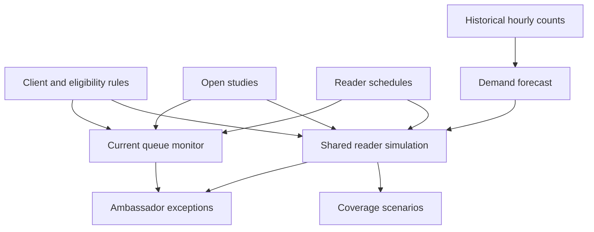

# Radiology SLA & Capacity Risk Monitor

A synthetic-data prototype for a teleradiology operations team, with current-queue monitoring and predictive coverage planning.

The monitor continuously ranks open studies by **operational risk** so ambassadors can spend less time manually watching queues and more time helping radiologists, clients, and true exceptions.

> **Important:** This project uses synthetic operational data only. It does not interpret medical images, determine clinical urgency, or make diagnostic decisions.

## Business problem

At scale, an operations team may have to track:

- client-specific turnaround-time requirements
- STAT / urgent / routine queues
- radiologist credentials by client
- modality eligibility
- active versus offline radiologists
- current reader workload
- approaching SLA breaches
- exceptions that require a person

Manual surveillance does not scale well. The goal is to convert that work into **exception-based operations**.

## MVP

The application:

1. Loads synthetic client SLA rules, radiologist eligibility, workload, and open studies.
2. Determines which active radiologists are eligible for each study.
3. Calculates an explainable 0–100 operational risk score.
4. Classifies each study as GREEN, YELLOW, or RED.
5. Produces a prioritized queue and a human-readable next action.
6. Separately displays radiologist capacity and utilization.

## Risk logic

The MVP score combines:

- **55% SLA pressure** — how much of the allowed turnaround time has elapsed
- **20% capacity pressure** — workload of eligible radiologists
- **15% eligibility pressure** — scarcity of eligible readers
- **10% priority pressure** — STAT / urgent / routine
- an additional penalty for an existing SLA breach

A study with **no active eligible reader** is automatically RED.

The weighting is intentionally transparent for a proof of concept. In production, contractual rules should remain deterministic while a calibrated predictive model can estimate future breach probability from historical operational data.

## Architecture

## Run locally

~~~bash
cd radiology-sla-capacity-monitor
python -m venv .venv

# Windows
.venv\Scripts\activate

# macOS/Linux
source .venv/bin/activate

pip install -r requirements.txt
streamlit run app.py
~~~

## Run tests

~~~bash
python -m pytest -q
~~~

## Phase 2 — Forecast & what-if planning

The **Forecast & what-if planning** tab answers: *Where will demand exceed qualified reading capacity, and which coverage change might help?*

- Learns hourly demand by client, modality, priority and weekday from 56 days of reproducible synthetic counts.
- Forecasts the next 2–12 hours, showing expected arrivals and historical variation.
- Samples 50–200 demand scenarios to model turnaround risk and end-of-window backlog.
- Applies client SLA rules and reader client/modality eligibility exactly as supplied.
- Models unique reader schedules, initial busy time and modality-specific reading duration. Shared readers cannot be counted as separate capacity for every client.
- Surfaces client/modality/priority exceptions and operational coverage-review recommendations.
- Compares baseline coverage with a volume change, absent reader, or full-window shift override for an existing reader.
- Exports hourly projections and client risk tables as CSV.
- Reports rolling holdout forecast accuracy against a flat recent-week baseline.

This is a statistical forecasting and simulation implementation. It does not require an LLM, an API key, or a hosted AI service. Its forecasts are learned from historical counts; credentials and SLAs remain deterministic.

### Demonstrate it

1. Start the app and select **Forecast & what-if planning**.
2. Keep the six-hour horizon and 100 scenarios.
3. Under **Scenario: cover full window with existing reader**, select **Dr. Brooks**.
4. Click **Compare coverage scenarios**.
5. Compare SLA misses and completions, then inspect which clients still need attention.
6. Test a 30% volume increase or remove an existing reader to see growth/coverage exposure.

The demo is anchored to **October 6, 2026 at 5 PM America/Chicago (22:00 UTC)**. It does not advance with the wall clock or ingest live feeds.

With seed 42 and 100 scenarios, the included synthetic six-hour example produces approximately:

| Metric | Baseline | Full-window Dr. Brooks coverage |
| --- | ---: | ---: |
| New studies | 285.3 | 285.3 |
| Completed studies | 159.2 | 205.9 |
| SLA misses within forecast window | 124.2 | 77.3 |
| End backlog | 138.2 | 91.4 |

These are invented operating conditions and simulated outcomes, not measured savings or results at Real Radiology or any employer. Adding the reserve reader still leaves gaps because its credentials and modalities do not cover every queue.

### Interpreting the numbers

**Simulated breach %** is the fraction of demand scenarios with at least one SLA miss for a client/modality/priority group among studies due within the forecast window. It is neither a per-study breach probability nor a calibrated real-world estimate. A large group can have a high chance of at least one miss even when its miss rate is low.

Completions and misses include the initial open queue. Initial busy minutes represent work outside that queue. Routine studies due after the forecast horizon may remain in backlog without being counted as SLA misses. Jobs cannot be started before arrival, served concurrently by one reader, or completed outside a reader's shift.

The 10th–90th arrival percentiles describe empirical demand variation. They are not confidence bounds on the estimated mean. Historical stream counts include every completed hour, including explicit zeros; missing hours or missing rules fail visibly rather than receiving invented defaults.

### Forecast evidence

The fixed demo performs 504 rolling stream/hour holdouts across the last seven synthetic days, one tested hour every four hours. Training excludes the held-out hour and future data. The seasonal estimate has approximately **1.25 studies MAE per stream/hour**, compared with **1.48** for a flat recent-week baseline; WAPE is approximately **46.7%**. This demonstrates a working evaluation path and substantial forecast uncertainty, not production readiness. SLA simulation probabilities have not been calibrated or backtested against actual outcomes.

### Phase 2 files

| File | Purpose |
| --- | --- |
| `forecast_engine.py` | Seasonal estimator, empirical sampling, shared-reader simulation, rolling holdout evaluation |
| `demo_history.py` | Reproducible synthetic hourly observations, including zero-count hours |
| `data/shifts.csv` | Explicit demo shift windows, initial busy minutes, speed assumptions |
| `tests/test_forecast_engine.py` | Forecast leakage, shared capacity, eligibility, shift boundaries, queue conservation and scenario tests |
| `tests/test_app.py` | Dashboard loading, scenario interaction and conflicting-control handling |
| `PHASE2_DEMO.md` | Short presentation and interview walkthrough |

Optionally create the synthetic history CSV for inspection with `python demo_history.py`. The dashboard generates the same history in memory; the exported CSV is ignored by git.

## Suggested production roadmap

### Phase 1 — Rules + live monitoring
Connect operational feeds for study status, SLA rules, radiologist eligibility, shift status, and queue workload.

### Phase 2 — Forecasting (implemented as a synthetic prototype)
Learn hourly demand patterns, compare them with scheduled qualified capacity, and simulate coverage changes. Replace demo history with validated operational counts before testing outside the portfolio.

### Phase 3 — Breach prediction
Train and calibrate a model using de-identified historical operational data to estimate the probability of an SLA miss before it occurs.

### Phase 4 — Next-best-action engine
Recommend queue redistribution, coverage escalation, or ambassador intervention while preserving deterministic credentialing and client rules.

### Phase 5 — Operations copilot
Allow authorized staff to ask questions such as:

- Which clients are at highest SLA risk in the next 30 minutes?
- Where do we have a CT capacity gap tonight?
- Which client requirements are driving the most manual interventions?
- What changed in the last hour?

## Safety / governance

A production version should:

- avoid PHI wherever operational identifiers are sufficient
- maintain role-based access
- log recommendations and human overrides
- keep credentialing, licensing, and contractual rules deterministic
- validate data freshness before acting
- require human review for material operational escalations
- never use this system for diagnosis or image interpretation

## Portfolio framing

This project demonstrates how healthcare operations can use AI and automation to shift staff from **manual surveillance** to **exception management**, increasing scalability while protecting radiologist focus and client service.
