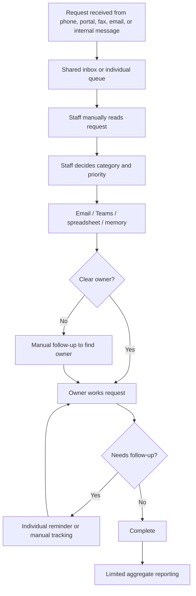
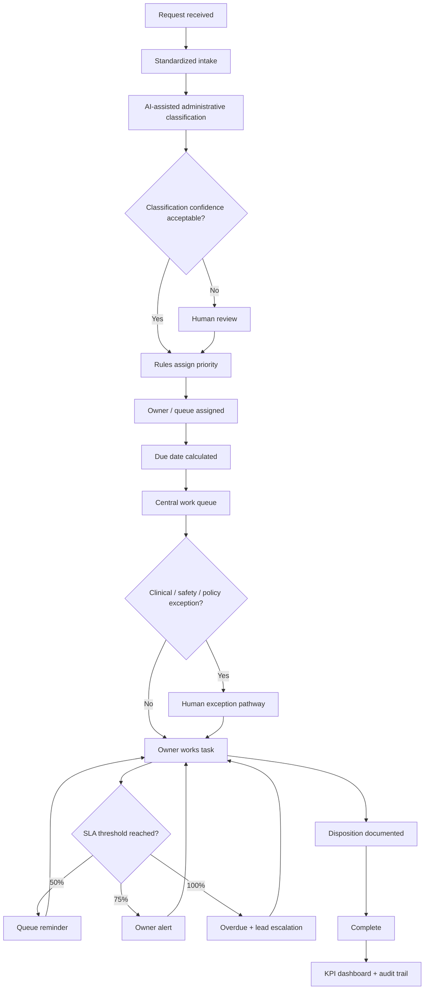

# Workflow Design

## Current State

### Current-State Failure Points

- inconsistent intake;
- manual classification;
- unclear ownership;
- multiple tracking locations;
- reminders depend on individual behavior;
- overdue work is difficult to identify;
- backlog is not visible in real time;
- exception handling is inconsistent.

---

## Future State

## Control Points

The future-state workflow deliberately preserves human control at high-risk points:

1. low-confidence classification;
2. clinical interpretation;
3. patient-safety concerns;
4. policy exceptions;
5. missing information;
6. unresolved ownership;
7. extended overdue work.

## Operating Model

The workflow is designed around five principles:

**One intake structure** — every request enters with the same required metadata.

**One accountable owner** — no task remains unassigned.

**One service-level clock** — deadlines are based on request type and priority.

**One exception pathway** — automation stops when human judgment is required.

**One performance view** — backlog, overdue work, handling time, and exceptions are visible to leaders.
